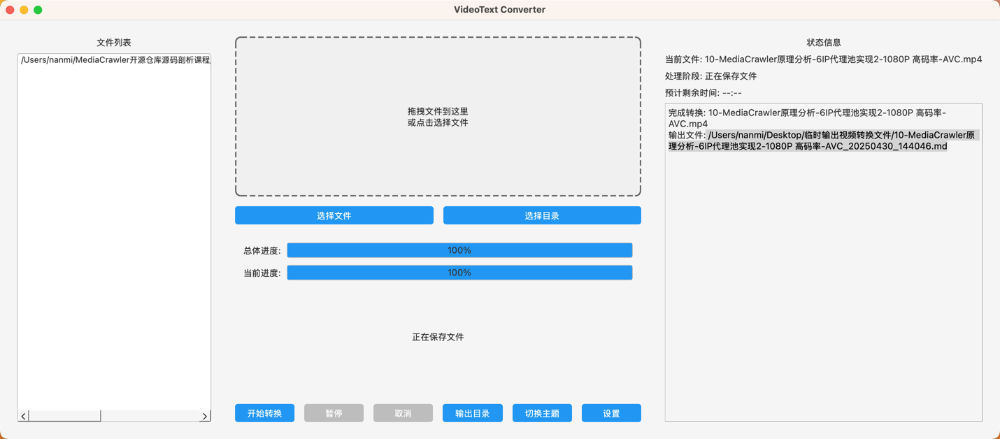

# Video2TextGPT

一个基于 PyQt6 的视频转文字工具，支持批量将视频转换为带时间戳的文本文档。

## 界面


## 功能特点

- 支持批量导入视频文件和文件夹
- 支持拖拽文件到界面
- 支持主流视频格式(mp4, avi, mkv等)
- 实时显示转换进度和状态
- 深色/浅色主题切换
- 系统托盘支持
- 可配置的转换参数
- 生成带时间戳和纯文本双格式输出

## 技术依赖

项目使用以下关键组件：

- **[Whisper](https://github.com/openai/whisper)** - OpenAI开发的多语言语音识别模型，支持多种语言的转写
- **[FunASR](https://github.com/modelscope/FunASR)** - 达摩院开源的语音识别模型，专为中文优化
- **[MoviePy](https://github.com/Zulko/moviepy)** - 视频处理库，用于提取音频
- **[PyQt6](https://www.riverbankcomputing.com/software/pyqt/)** - 界面框架

## 系统要求

- FFmpeg (用于音频处理)
- CUDA (可选，用于GPU加速)

## 安装部署

1. 克隆仓库
```bash
git clone https://github.com/NanmiCoder/Video2TextGPT.git
cd Video2TextGPT
```

2. 安装 FFmpeg (如果未安装)

Windows:
```bash
choco install ffmpeg
```

macOS:
```bash
brew install ffmpeg
```

Linux:
```bash
sudo apt update
sudo apt install ffmpeg
```


## 使用说明

1. 启动应用
> 需要先安装 [uv](https://docs.astral.sh/uv/getting-started/installation/) 包管理工具
```bash
uv run src/main.py
```

1. 添加视频文件
   - 点击"选择文件"按钮选择单个或多个视频文件
   - 点击"选择目录"按钮选择包含视频的文件夹
   - 直接将文件拖拽到应用窗口

2. 开始转换
   - 点击"开始转换"按钮开始处理
   - 可以随时暂停/继续/取消转换
   - 转换完成的文件将保存在配置的输出目录中

3. 配置选项
   - 转写引擎选择：Whisper 或 FunASR
   - Whisper模型选择(tiny/base/small/medium/large)
   - 识别语言设置
   - 界面主题设置
   - 输出目录设置
   - 系统托盘设置

## 项目结构

```
Video2TextGPT/
├── src/                    # 源代码目录
│   ├── gui/               # 图形界面相关
│   ├── core/              # 核心功能
│   │   ├── converter.py   # 转换管理
│   │   ├── extractor.py   # 音频提取
│   │   └── transcriber.py # 语音识别
│   └── utils/             # 工具类
│       ├── config.py      # 配置管理
│       └── logger.py      # 日志管理
```

## 输出格式

生成的文档包含以下内容：

1. 视频基本信息：文件名、创建时间、视频时长
2. 转写文本（带时间戳）：格式为 `[HH:MM:SS.SS --> HH:MM:SS.SS] 文本内容`
3. 纯文本版本：去除时间戳的纯文本，方便阅读和编辑

## 配置文件

配置文件位于 `~/.videotext/config.json`

## 许可证

MIT License

## 更新日志

### v1.0.0
- 初始版本发布
- 基本功能实现：
  - 视频批量导入
  - 音频提取
  - 文本转写
  - 主题切换
  - 系统托盘
  - 配置管理


